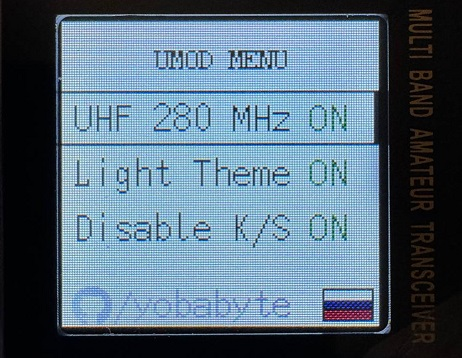

# µMod for TIDRADIO H3
 

This is a small *(or more like micro)* firmware modification for TIDRADIO H3.

## Disclaimer
Use at your own risk. *The author does not give any guarantees and is not responsible for damaged radios while using the modified firmware.*

## Features
* Switch VHF/UHF filter boundary to 280 MHz *(instead of 300 MHz by default)*.
* Completely disable KILL and STUN modes *(no one can brick your radio)*.
* Light theme *(just a color inversion with some additions)*.

## Install
Program the mod **.BIN** file from [releases](https://github.com/yobabyte/tid_umod/releases/latest) using any IAP tool (e.g. [TD-H3_IAP](https://www.walkietalkiesoftware.com/portal/index/software_detail/id/69.html) from TID).

## Usage
Press **PTT+FN** *(**FN** is the button that turns on the flashlight)* and turn on the radio.

Navigate through the menu using **UP/DOWN** buttons.

Toggle **ON/OFF** using **MENU** button *(blue)*.

Use **BACK** button to save the settings and exit the menu.
