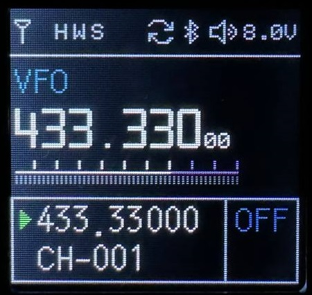
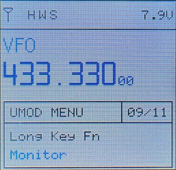

# µMod for TIDRADIO H3
 

uMod _(or Ultimate Mod)_ is a firmware modification for TIDRADIO H3.

Join the [Tidradio TD-H3 community on Telegram](https://t.me/TD_H3).

Buy TD-H3 [from the AliExpress store](https://aliexpress.com/item/3256806485271821.html) or [from the official website](https://tidradio.com/products/h3-ham-radio).

## Disclaimer
Use at your own risk. *The author does not give any guarantees and is not responsible for damaged radios while using the modified firmware.*

## Features
* Improved/refined UI
* S-meter with scale up to S9+30 and dBm display
* Modulation override to AM/FM/USB
* Change VHF/UHF filter border frequency to 280 MHz and below _(instead of default 300 MHz)_
* Light theme and frequency color selection _(in Sync mode)_
* Battery indicator selection: icon _(default)_, volts, percentage
* Automatic switching of active A/B channel when transmitting and receiving _(in Dual Watch mode)_
* Display raw RSSI/Ex-noise values of BK4819 chip
* Display noise level (Ex-noise) on S-meter scale
* Configuring the FN button _(Flashlight button)_
* Reset Kill/Stun flags via key combination during radio power up

## Install
Program the mod **.BIN** file from [releases](https://github.com/yobabyte/tid_umod/releases/latest) using any IAP tool (e.g. [TD-H3_IAP](https://www.walkietalkiesoftware.com/portal/index/software_detail/id/69.html) from TIDRADIO).

After installing a new version reset the mod settings using **Reset Mod Settings** option.

## Mod Menu

* To enter the menu, return to the main screen and press **7** for 1-2 seconds
* To navigate through the menu, use the **UP/DOWN** buttons.
* Use the **MENU** key to toggle the option value
* Use the **BACK** button to save the settings and exit the menu

## Detailed description of the features
### RF Modulation
Forces **AM**/**FM**/**USB** modulation, for reception only.

### VHF/UHF Filter (SATCOM unlock)
Sets the frequency of the VHF/UHF filter switching boundary. The frequencies available for selection are **300** _(Default)_/**280**/**270**/**265** MHz.

### Color Theme
Sets **Dark**/**Light** color theme.

### Frequency Color
Sets the frequency color _(in Sync mode)_, 8 colors are available.

### Battery Style
Selects the type of battery indicator **Icon**/**Voltage**/**Percent**.

### Channel Switch
Selects the automatic switching mode of the active A/B channel. Available options: **Default** _(default behavior)_/**Tx Only** _(transmit only)_/**Rx Only** _(receive only)_/**Both** _(Tx+Rx)_.

Notes: automatic channel switching during **Rx** is only possible when **9. D.Wait** _(Dual Watch)_ is **ON**.

### Show RSSI/Noise
Turns on the RSSI/Ex-noise values display during Rx.

### Show Noise Meter
Turns on the noise level display on the S-meter scale.

### Long Key Fn
Selects the function for a long press of the FN button. Available functions: **None**/**FM Radio**/**Lamp**/**Monitor**/**Tx Tone**/**Alarm**/**Weather**.

### Short Key Fn
Selects the function for a short press of the FN button. Available functions: **None**/**FM Radio**/**Lamp**/**Tx Tone**/**Alarm**/**Weather**.

### Reset Mod Settings
Resets modification settings.

### Reset Kill/Stun Flags
Resets Kill/Stun flags.

To use it, turn off the radio, simultaneously press **PTT1** _(large PPT button)_ + **FN** _(under the PTT buttons)_, hold them and turn on the radio.