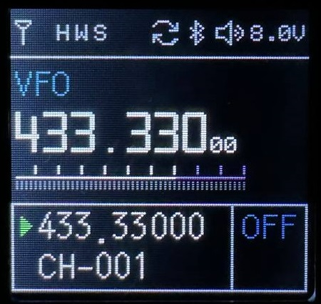

# uMod для TIDRADIO H3
 

uMod _(или Ultimate Mod)_ это модификация оригинальной прошивки для TIDRADIO H3.

Присоединяйтесь к сообществу [Tidradio TD-H3 в Telegram](https://t.me/TD_H3).

Приобрести рацию можно [в магазине AliExpress](https://aliexpress.com/item/3256806485271821.html) или [на официальном сайте](https://tidradio.com/products/h3-ham-radio).

## Предупреждение
Используйте на свой страх и риск. *Автор не дает никаких гарантий и не несет ответственности за испорченные рации во время использования мода.*

## Возможности
* Доработанный UI главного экрана
* S-метр со шкалой до S9+30 и показом dBm
* Принудительная установка модуляции AM/FM/USB
* Изменение частоты границы VHF/UHF фильтров на 280 MHz и ниже _(вместо 300 MHz по умолчанию)_
* Светлая тема и выбора цвета частоты _(в Sync режиме)_
* Выбор индикатора батареи: иконка _(по-умолчанию)_, вольты, проценты
* Автоматическое переключение активного канала A/B при передаче и приеме _(в режиме Dual Watch)_
* Вывод на экран значений RSSI/Ex-noise чипа BK4819
* Отображение уровня шума (Ex-noise) на шкале S-метра
* Конфигурирование функциональной кнопки _(кнопка Flashlight)_
* Сброс флагов Kill/Stun через комбинацию клавиш во время включения

## Установка
Загрузите в рацию **.BIN** файл из [релизов](https://github.com/yobabyte/tid_umod/releases/latest) с помощью любой утилиты для прошивки *(IAP)* (напр. [TD-H3_IAP](https://www.walkietalkiesoftware.com/portal/index/software_detail/id/69.html) от TIDRADIO).

После установки новой версии рекомендуется делать сброс настроек мода с помощью опции **Reset Mod Settings**.

## Меню мода

* Для входа в меню вернитесь на главный экран и зажмите клавишу **7** на 1-2 секунды
* Для навигации по меню используйте кнопки **ВВЕРХ/ВНИЗ**
* Для переключения значения опции используйте кнопку **МЕНЮ**
* Используйте кнопку **НАЗАД** для сохранения настроек и выхода из меню

## Описание функций
### RF Modulation
Принудительно устанавливает выбранную модуляцию **AM**/**FM**/**USB**, только для приема.

### VHF/UHF Filter (SATCOM unlock)
Устанавливает частоту границы переключения VHF/UHF фильтров. Для выбора доступны частоты **300** _(Default)_/**280**/**270**/**265** MHz.

### Color Theme
Устанавливает цветовую тему **Dark**/**Light**.

### Frequency Color
Устанавливает цвет частоты _(в режиме Sync)_, доступно 8 цветов.

### Battery Style
Выбор типа индикатора батареи **Icon**/**Voltage**/**Percent**.

### Channel Switch
Выбор режима автоматического переключения активного канала A/B. Доступные варианты: **Default** _(поведение по умолчанию)_/**Tx Only** _(только для передачи)_/**Rx Only** _(только для приема)_/**Both** _(Tx+Rx)_.

Примечания: автоматическое переключение канала во время приема возможно только при включенной опции **9. D.Wait** _(Dual Watch)_.

_Активный канал - это канал, слева от которого находится иконка зеленой стрелки._

### Show RSSI/Noise
Включение отображения значений RSSI/Ex-noise во время приема.

### Show Noise Meter
Включение отображения уровня шума на шкале S-метра.

### Long Key Fn
Выбор функции для долгого нажатия функциональной кнопки. Доступные функции: **None**/**FM Radio**/**Lamp**/**Monitor**/**Tx Tone**/**Alarm**/**Weather**.

### Short Key Fn
Выбор функции для короткого нажатия функциональной кнопки. Доступные функции: **None**/**FM Radio**/**Lamp**/**Tx Tone**/**Alarm**/**Weather**.

### Reset Mod Settings
Сбрасывет настройки модификации.

### Reset Kill/Stun Flags
Сбрасывает флаги Kill/Stun _(разблокирует рацию)_.

Для использования необходимо выключить рацию, одновременно зажать кнопки **PTT1** _(большая клавиша передачи)_ + **FN** _(под кнопками PTT)_ и удерживая их включить рацию.
